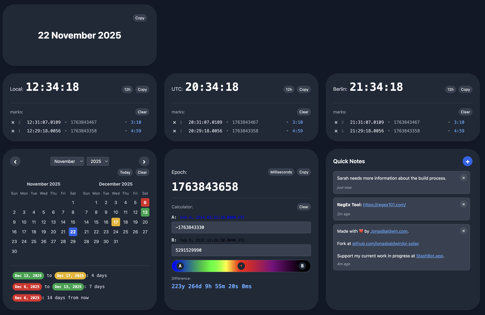
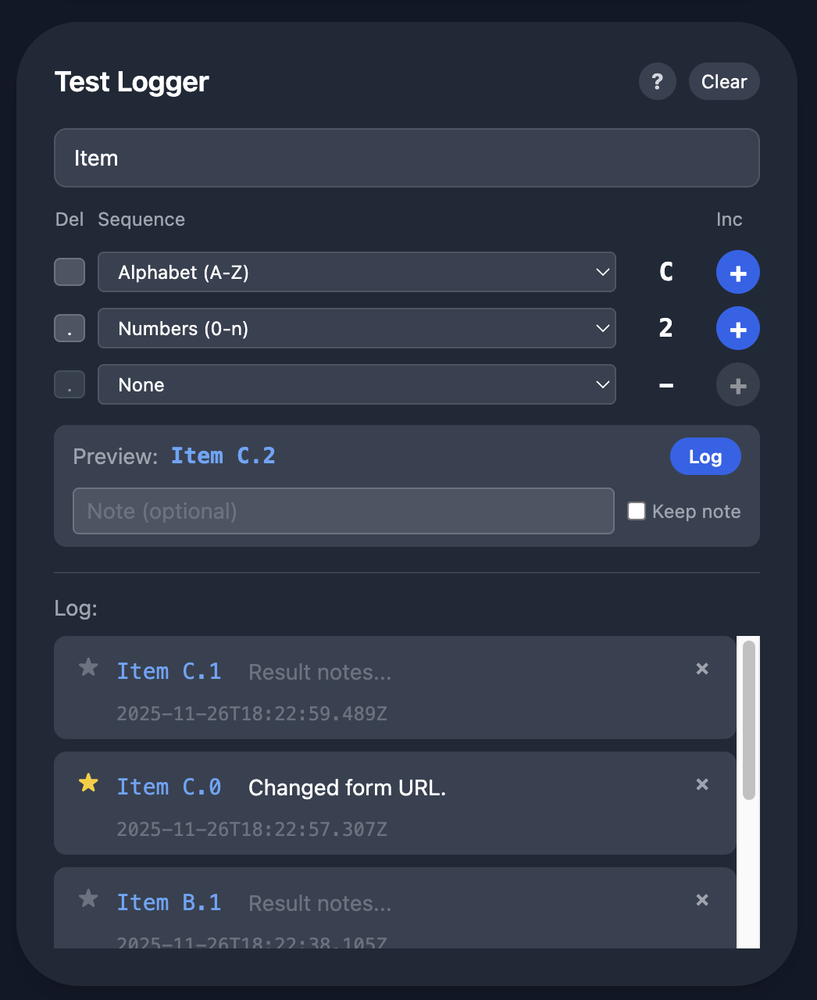

# Pi-splay

Pi-splay is a touch-friendly modular dashboard built with HTML, TypeScript, Tailwind CSS, and SASS. It features customizable tiles that can be rearranged and edited, with a focus on time tracking and development tools.



## Features

- **Modular Tile System**: Drag-and-drop tiles that can be rearranged on the dashboard
- **Touch-Friendly**: Optimized for touch devices with responsive design
- **Responsive Layout**: Works seamlessly on both large and small screens
- **Module Library**: Several modules to create your custom dashboard.

## Available Modules

- **Time Module**: Displays the current time in a specified timezone (local, UTC, or IANA timezone). Features include:
  - Toggle between 12-hour and 24-hour format (synchronized across all time modules)
  - Create time marks by tapping/clicking (shows exact time with milliseconds timestamp)
  - Copy current time to clipboard
  - View elapsed time since each mark
  - Marks are synchronized across all time modules
  - Supports unlimited marks with scrolling

- **Date Module**: Displays the current date in a readable format (e.g., "15 January 2024"). Features include:
  - Copy date to clipboard
  - Automatically updates when the date changes

- **Calendar Module**: Interactive calendar for date selection and comparison. Features include:
  - Navigate between months and years
  - Select multiple dates (each with a unique color)
  - View date comparisons (days between selected dates and from today)
  - Shows two months side-by-side
  - Clear all selected dates

- **Epoch Module**: Displays and calculates with Unix epoch timestamps. Features include:
  - Toggle between seconds and milliseconds display
  - Real-time epoch timestamp display
  - Calculator with two inputs (A and B) to compare timestamps
  - Visual timeline scale showing the relationship between timestamps
  - Color-coded timeline (green→red for past, red→purple for future)
  - Detailed elapsed time breakdown between timestamps
  - Copy epoch value to clipboard


- **Test Logger Module**: Track and differentiate test iterations with unique, sequential identifiers. Features include:


  - Optional test identifier prefix
  - Up to four sequence levels (primary, secondary, tertiary, quaternary)
  - Sequence types: Alphabet (A-Z), Greek (α-ω), Numbers (0-n), or Custom
  - Custom sequences support comma-separated values or individual characters
  - Customizable delimiters between sequence levels
  - Increment buttons to advance sequences (resets sub-sequences)
  - Log button copies identifier to clipboard and logs the test
  - Add notes before or after logging
  - Star important log entries
  - Toggle timestamp display (UTC, seconds, milliseconds)
  - Keep note option to preserve notes between logs

- **Number Converter Module**: Converts numbers between different number systems. Features include:
  - Convert between decimal, binary (0b), hexadecimal (0x), and octal (0o)
  - Real-time conversion as you type
  - Copy values in any format to clipboard

- **Timezone Converter Module**: Converts dates and times between different timezones. Features include:
  - Set source timezone (local, UTC, or IANA timezone)
  - Add multiple target timezones for comparison
  - Optional date and time inputs (defaults to current time)
  - Shows DST (Daylight Saving Time) indicators
  - Displays converted times in all target timezones
  - Remove individual timezones from the list

- **Format Helper Module**: Reference guide for date/time formatting in various programming languages. Features include:
  - Format examples for JavaScript, Python, Java, Clojure, C, Go, Rust, PHP, Bash, Zsh, and Fish
  - Set custom date and time to see formatted examples
  - Shows format code and example output for each format
  - Includes ISO formats, timestamps, and component extraction

- **Map Module**: Interactive map for location viewing and coordinate management. Features include:
  - Search locations by name (city, country, state)
  - Enter coordinates directly (latitude/longitude)
  - Click on map to set location
  - Displays current coordinates and location name
  - Uses OpenStreetMap tiles
  - Zoom and pan controls
  - Clear map to reset view

- **Quick Notes Module**: Simple note-taking with markdown support. Features include:
  - Create, edit, and delete notes
  - Markdown formatting (bold, italic, code, headers)
  - Automatic URL detection and linking
  - Drag-and-drop reordering of notes
  - Relative timestamps (e.g., "2h ago", "3d ago")
  - Click to edit, blur to save
  - Supports multi-line notes


## Prerequisites

- Node.js (v16 or higher)
- npm (v7 or higher)

## Installation

1. Clone the repository:
```bash
git clone <repository-url>
cd pi-splay
```

2. Install dependencies:
```bash
npm install
```

## Build

Build the project for production:

```bash
npm run build
```

This command will:
- Compile SASS to CSS and process with Tailwind CSS
- Bundle TypeScript to a single JavaScript file (using esbuild)
- Output static files to the `dist/` directory

The build produces static files that can be served without a build step:
- `dist/styles.css` - Compiled and minified CSS
- `dist/main.js` - Bundled and minified JavaScript (all dependencies included)

### Build Options

- `npm run build` - Full build (CSS + JavaScript bundle)
- `npm run build:css` - Build only CSS (SASS + Tailwind)
- `npm run build:js` - Build only JavaScript bundle
- `npm run build:ts` - Type-check TypeScript (doesn't create bundle)

## Development

Run in development mode with file watching:

```bash
npm run dev
```

This will:
- Watch for changes in TypeScript files and rebuild the JavaScript bundle
- Watch for changes in SASS files and rebuild CSS
- Automatically update when you make changes

### Watch Options

- `npm run dev` - Watch both CSS and JavaScript
- `npm run watch:css` - Watch only CSS files
- `npm run watch:js` - Watch only JavaScript files (rebundles on changes)
- `npm run watch:ts` - Type-check TypeScript only (doesn't create bundle)

## Running

After building, the dashboard can be run in two ways:

### Static Files (Production)

The build produces static files that work without a server. Simply open `index.html` in a web browser:

```bash
# After building
open index.html  # macOS
# or double-click index.html in your file manager
```

All JavaScript is bundled into a single file, so no build step or server is required at runtime.

### Using a Local Server (Development)

For development, you can use a local web server:

```bash
# Using Python 3
python3 -m http.server 8000

# Using Node.js (if you have http-server installed)
npx http-server

# Using PHP
php -S localhost:8000
```

Then open `http://localhost:8000` in your browser.

## Configuration

### Default Tiles

By default, the dashboard initializes with two time modules:
- **Local Time**: Displays the current local time
- **UTC Time**: Displays the current UTC time

### Tile Configuration

Tiles are configured in `src/main.ts`. Each tile has the following structure:

```typescript
{
  id: string,           // Unique identifier
  type: 'time',         // Tile type (currently only 'time')
  size: 's' | 'm' | 'l', // Tile size (small, medium, large)
  data: {
    timezone: 'local' | 'utc',  // Timezone for time display
    marks: TimeMark[]           // Array of time marks (max 4)
  }
}
```

### Adding Custom Tiles

To add more tiles, modify the `defaultTiles` array in `src/main.ts`:

```typescript
const defaultTiles: Tile[] = [
  {
    id: generateId(),
    type: 'time',
    size: 's',
    data: {
      timezone: 'local',
      marks: []
    }
  },
  // Add more tiles here...
];
```

### Tile Sizes

- **Small (s)**: 500px wide (1x)
- **Medium (m)**: 1000px wide (2x)
- **Large (l)**: 1500px wide (3x)

On smaller screens (< 1024px), medium and large tiles will automatically resize to fit the viewport.

## Usage

### Time Modules

- **Viewing Time**: Time modules display the current time in 24-hour format (HH:MM:SS)
- **Creating Marks**: Tap anywhere on a time module to create a mark showing:
  - The exact time in HH:MM:SS.nnnn format (with milliseconds)
  - The epoch timestamp
- **Mark Storage**: Each time module can store up to 4 marks. New marks are added to the top, and older marks are removed when the limit is reached.

### Rearranging Tiles

- **Desktop**: Click and drag tiles to rearrange them
- **Touch Devices**: Long-press and drag tiles to rearrange them
- Tiles will show a visual indicator when being dragged

## Project Structure

```
pi-splay/
├── dist/              # Compiled output files
├── src/
│   ├── components/    # React-like component classes
│   │   ├── TileManager.ts
│   │   └── TimeModule.ts
│   ├── styles/
│   │   └── main.sass   # SASS styles with Tailwind
│   ├── utils/
│   │   └── time.ts     # Time utility functions
│   ├── types.ts        # TypeScript type definitions
│   └── main.ts         # Application entry point
├── index.html          # Main HTML file
├── package.json        # Dependencies and scripts
├── tailwind.config.js  # Tailwind CSS configuration
└── tsconfig.json       # TypeScript configuration
```

## Technologies

- **TypeScript**: Type-safe JavaScript
- **esbuild**: Fast JavaScript bundler for production builds
- **Tailwind CSS**: Utility-first CSS framework
- **SASS**: CSS preprocessor with indented syntax
- **HTML5**: Modern web standards

## Browser Support

The dashboard is designed to work on modern browsers that support:
- ES2020 JavaScript features
- CSS Grid
- Touch events
- Drag and Drop API

Recommended browsers:
- Chrome/Edge (latest)
- Firefox (latest)
- Safari (latest)
- Mobile browsers (iOS Safari, Chrome Mobile)
